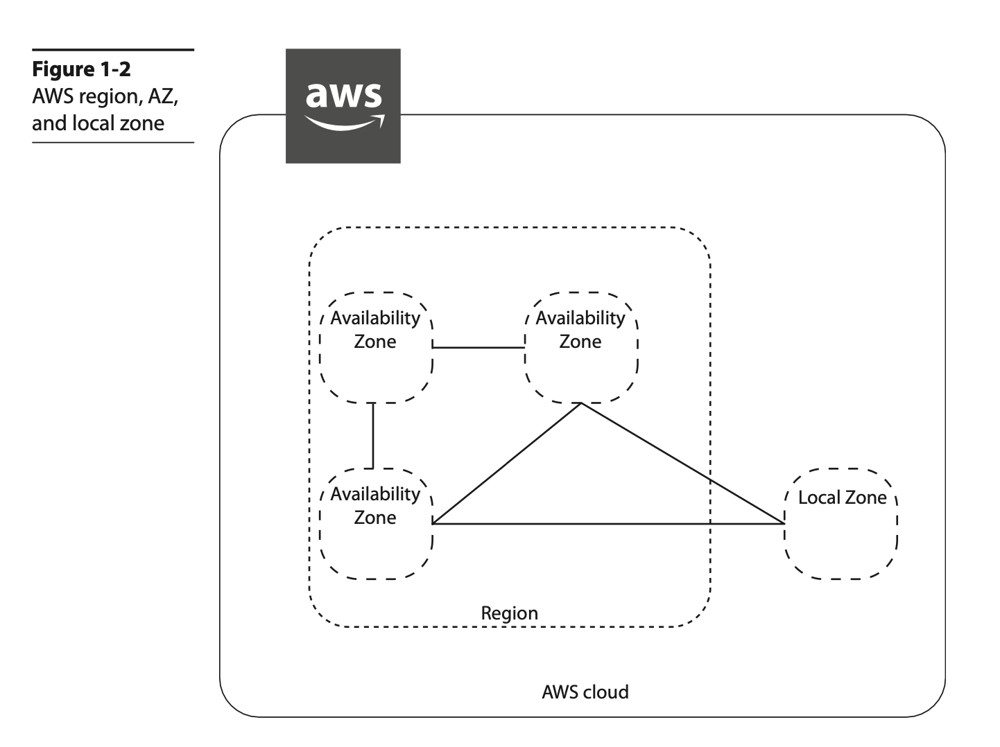
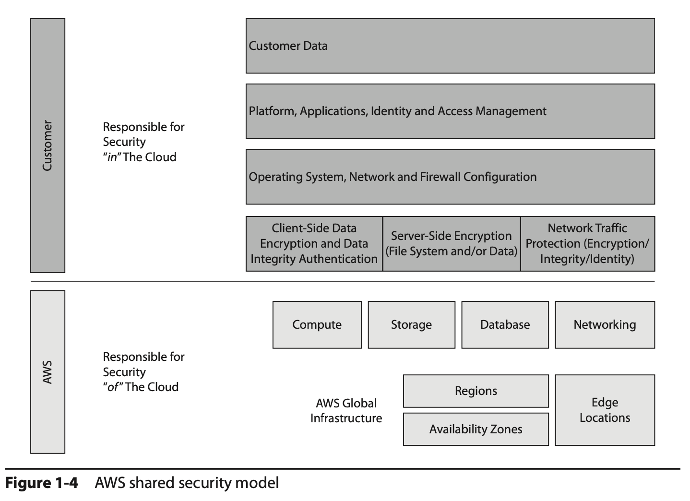

# Chapter 1 - Overview of Cloud Computing and Amazon Web Services

The National Institute of Standards and Technology (NIST) defines cloud computing as:

> "Ubiquitous, convenient, on-demand access to shared computing resources that can be rapidly provisioned and released with minimal management effort."

Three basic characteristics of the cloud:

- **On demand**: Cloud computing enables you to use IT infrastructure as a resource that is always available on demand per your needs.
- **Accessible from the Internet**: All the resources that you deploy in the cloud are accessible from the Internet.
- **Pay-as-you-go model**: When you use cloud computing, you pay per your usage.

Many reasons for using the cloud. For example, If you are a startup, you can just focus on the next big idea and forget about purchasing and managing the hardware.

## Advantages of Running Cloud Computing on AWS

| **Advantages** | Description |
| -- | -- |
| **Gaining agility** | You can provision all the resources you need almost instantly. |
| **Avoiding guessing about capacity** | Since the cloud is elastic, which means you can scale up and scale down based on your requirements at any time, you can provision only the resources that you need at any point of time. |
| **Moving from capital expenses to variable/flexible expenses** | It becomes difficult to get approval for new hardware each time you want to start a project. With an operational expense model, you have zero up-front costs. |
| **Benefiting from massive economics of scale** | A user of cloud computing benefits from the massive economies of scale since hundreds of thousands of customers are aggregated in the cloud. This in turns translates to low pay-as-you-go prices. |
| **Avoiding spending money on data centers** | With cloud computing you don’t have any overhead to manage the data center, and you can focus more on what the business needs. |
| **Benefiting from the pace of innovation** | Customers can use all the new products and features instantly, whenever they  are released. The moment a new feature is available, it is automatically available to you. |
| **Going global in minutes** | With cloud computing, you don’t have to wait for months or even days to operate from a different region. With just a few mouse clicks and a few minutes, you can be ready to operate from a different region. You can do it almost instantly. |

### Three Models of Cloud Computing

| **Cloud Computing Models** | Description |
| -- | -- |
| **Infrastructure as a Service (IaaS)** | Provides the foundation for a cloud IT environment that includes compute (server), networking, storage, and space in a data center. |
| **Platform as a Service (PaaS)** | Just want to focus on deploying and managing the applications. PaaS eliminates the job of managing the entire infrastructure layer. |
| **Soft-ware as a Service (SaaS)** | Way of delivering applications over the Internet. SaaS provider offers a complete product that is hosted and managed by the product vendor, you just need to think about how you are going to use the product. |

### Three Cloud Computing Deployment Models

| **Cloud Computing Deployment Models** | Description |
| -- | -- |
| **All-in cloud** | You design and deploy an application in a public cloud using a cloud service provider. |
| **Hybrid** | You host some of the applications in the cloud and some of the applications at your own premises. |
| **On-premise or private cloud** | When you deploy the resources in your own data center using virtualization or resource management tools. |

## History of AWS

- AWS was officially launched in 2006.
- AWS has more than 175 fully featured services.

## AWS Global Infrastructure

- AWS works in 190 countries around the world.
- AWS serves these customers via its global infrastructure, which consists of **regions**, **availability zones (AZs)**, and **points of presence (POPs)**.

### Regions

- AWS maintains 24 regions spanning five continents in the world, with three additional regions being planned.
- A region is a physical location in the world that comprises clusters of highly redundant data centers. The regions are separated geographically, which provides data sovereignty. You can think of a region as a distinct geographical location where AWS services are made available.

> **Note**: By default, data residing in a region never leaves a region unless explicitly moved by AWS customers.

- AWS also offers the **GovCloud** region in the United States, which is designed for government agencies to run their workloads in the cloud. Though it is designed for government agencies, other customers can also use this region.

### Availability zones (AZs)

- Within each region there are availability zones (AZs). An AZ consists of one to six data centers, with redundant power supplies and networking connectivity. As of this writing, there are 76 AZs.

- A single data center can be part of only one AZ. Each AZ is located in a different floodplain; power grids are designed in such a way that a natural calamity or disaster does not impact multiple AZs.

- The networking among the AZs in a particular region is designed in such a way that it offers inexpensive, low-latency, private, fiber-optic network connectivity to another AZ in the same region. The latency between the AZs within a region is less than a single digit.

- The biggest advantage of this is that you can design an application in such a way that it can run on multiple AZs, and since the data can be synchronously replicated within the AZs, in the case of a disaster taking one of the AZs down, there is no impact on your application.

### Local zones

- Using this local zones, you can run a few specific AWS services closer to user populations where no AWS regions exist.

- The local zones are connected to the parent region via a high-bandwidth private network, thereby enabling seamless access to rest of the AWS series that is unavailable in these local areas.

### Points of presence (POPs) - Edge locations

- These edge locations are in most of the major cities across the globe.

- At the time of this writing, there are 216 POPs.

- The edge locations are mainly used by content delivery networks to distribute content to nearby end users to reduce latency and provide fast performance.

- For example, when you watch a video from Amazon Video, the video will be cached in an edge location so that when another customer watches the same video, it will be served from an edge loca- tion for a quick turnaround time and better user experience.

- In addition to edge locations, AWS has recently added regional edge cache locations between the main servers and the edge locations. When an object is not accessed for a long time, it goes out of the cache, but because the regional edge cache maintains a larger cache, the object can be stored there for a longer amount of time.

- The POPs consist of both edge locations as well as the regional edge caches.

> **EXAM TIP**: AWS has 24 regions and 76 AZs as of this writing. Since AWS keeps adding regions and AZs, please check the web site to get the latest numbers.

## AWS Security and Compliance

AWS follows the model of **shared security**, which means AWS is responsible for the secu- rity of the cloud, and customers are responsible for the security in the cloud.

In the case of a managed service (for example, Amazon RDS, Amazon Redshift, Amazon DynamoDB, and so on), AWS is also responsible for the security configuration of it.

## AWS Products and Services

Now, AWS has more than 175 services that include compute, storage, networking, database, analytics, application services, deployment, management, and mobile services.

### Compute

The compute services include both servers and serverless configuration.

| **Services** | Description |
| -- | -- |
| **Amazon Elastic Compute Cloud (EC2)** | It includes the virtual servers, called *instances*, in the cloud. Depending on the use case, the customer can choose from a variety of instance types. |
| **Amazon EC2 Auto Scaling** | It helps in automatically scaling the Amazon EC2 instances up and down as per the policies you define, it ensures that you are always running with the desired number of instances. No additional charge for using Amazon EC2 Auto Scaling. Amazon EC2 Auto Scaling integrates with Elastic Load Balancer|
| **AWS Lambda** | AWS Lambda enables you to run code without provisioning or managing any servers or infrastructure. You simply develop code for your application or back-end service and define the event triggers with the AWS Lambda service. AWS Lambda then takes care of provisioning the resources to run your code, produce the results, and tear down the code. You pay only for the compute time when the code is getting executed; there is no charge when the code is not running. |
| **Amazon EC2 Container Service (ECS)** | It allows you to run Docker containers on Amazon EC2 instances. There are no separate charges for Amazon ECS; you pay only for the AWS resources used. |
| **Amazon Elastic Kubernetes Service (EKS)** | It is a fully managed Kubernetes service that makes it easy for you to run your code on AWS without needing to install and operate your own Kubernetes control plane or worker nodes. |
| **AWS Fargate** | It is a serverless compute engine for containers that works with both Amazon ECS and Amazon EKS. It utomatically scale, load balance, and manage scheduling of your containers for availability. |
| **AWS Elastic Beanstalk** | It lets you run and manage web applications without worrying about the underlying infrastructure. There is no addi- tional charge for AWS Elastic Beanstalk; you pay only for the AWS resources needed to run your applications. |
| **Amazon Lightsail** | It  is the simplest way to get started with AWS for small businesses, devel- opers, students, and other users who need a simple virtual private server (VPS) solution. Amazon Lightsail provides storage, networking capacity, and compute capabilities to manage and deploy web sites and web applications in the cloud. It includes a virtualized compute server, DNS management, SSD-based storage, data transfer capa- bilities, and a static IP address for a low, predictable monthly price. |
| **AWS Batch** | It enables users to efficiently run hundreds of thousands of batch comput- ing jobs on AWS. IT dynamically provisions the optimal type and quantity of compute resources |
| **AWS Outposts** | It helps in extending AWS services to any data center. Using Outposts, you can run all the AWS services, APIs, and tools at your data center, at a partner data cen- ter, or at a colocation facility. It is an ideal platform to provide a hybrid experience. Outposts is the on-premise version of the AWS cloud. |

### Networking

Networking is part of the AWS core services. AWS networking helps you to isolate your cloud infrastructure.

| **Services** | Description |
| -- | -- |
| **Amazon Virtual Private Cloud (VPC)** | Using this service, you can isolate cloud resources within your own private virtual network. You can say that an Amazon VPC is your own data center in the cloud. You have complete control over the networking in an Amazon VPC. You can bring your own IP addresses, you can define the subnets as you want, and you have full control over the route table and network gateways. |
| **Amazon Route 53** | It is a Domain Name System (DNS) web service. It is highly available and scalable, and its SLA is 100 percent uptime. Amazon Route 53 is IPv4 as well as IPv6 compliant |
| **Elastic Load Balancing** | It allows you to automatically distribute the load across multiple Amazon EC2 instances. It can be integrated with Auto Scaling; as a result, you can auto- matically scale up and down your Amazon EC2 instance and dynamically grow and shrink your operation depending on the traffic. |
| **AWS Direct Connect** | Using this service, you can establish private, dedicated network connectivity from your data center to AWS. You can reduce bandwidth costs for high-volume data transfers and get consistent network performance.|
| **AWS App Mesh** | It helps monitor, control, debug, and trace communications between services. It's based on the open source Envoy service. |
| **AWS Global Accelerator** | It improves the availability and performance of your applications for global users. It provides a set of static IP addresses that are anycast from the AWS edge network, which provides a fixed entry point to your applications and eliminates the com- plexity of managing specific IP addresses for different AWS regions and AZs. |

### Security and Compliance

The security of the cloud is the highest priority for AWS.

| **Services** | Description |
| -- | -- |
| **AWS Identity and Access Management (IAM)** | It is used to create users, groups, and roles. It is also used to manage and control access to AWS services and resources. |
| **Amazon Inspector** | It is an automated security assessment service that helps you to identify the security vulnerabilities in your application when it is being deployed as well as when it is running in a production system. |
| **AWS Certificate Manager (ACM)** | It is used to manage Secure Sockets Layer (SSL) certifi- cates for use with AWS services. Using ACM, you can provision, manage, and deploy SSL/Transport Layer Security (TLS) certificates. |
| **AWS Directory Service** | It is an AWS managed directory service built on Microsoft Active Directory. It can be used to manage directories in the cloud. |
| **AWS Web Application Firewall (WAF)** | It is a web application firewall that detects mali- cious traffic targeted at the web applications. Using WAF, you can create various rules with which you can protect against common attacks such as SQL injection and scripting.  |
| **AWS Shield** | It is a managed service that protects against distributed denial-of-service (DDoS) attacks targeted at the web applications. There are two tiers of AWS Shield: Standard and Advanced. AWS Shield Standard is free and protects against most com- monly occurring DDoS attacks against web applications. With AWS Shield Advanced, you get higher levels of protection targeting not only against web applications but also Elastic Load Balancer, Amazon CloudFront, and Amazon Route 53. |
| **Amazon GuardDuty** | It is a threat-detection service that continuously monitors your AWS accounts and workloads to protect them. It provides broad protection of your AWS accounts, workloads, and data by helping to identify threats such as attacker reconnais- sance, instance compromise, and account compromise. |
| **Amazon Macie** | It helps you protect your data in Amazon S3 by helping you classify what data you have, the business value of that data, and the behavior associated with access to that data. It uses machine learning. |
| **AWS Secrets Manager** | It is a secrets management service that helps you protect access to your applications, services, and IT resources. |
| **AWS SSO** | AWS Single Sign-On (SSO) is an AWS service that enables you to use your existing cre- dentials from Microsoft Active Directory to access your cloud-based applications, such as AWS accounts and business applications (Office 365, Salesforce, Box), by using SSO. |
| **AWS CloudHSM** | It provides you with a dedicated hardware security module (HSM) in the AWS cloud. It helps you to meet all the contractual and regulatory com- pliance requirements. The HSM is a tamper-resistant hardware, which provides secure key storage and cryptographic operations. |
| **AWS KMS** | IT  is a managed service that helps you create and control the keys used for cryptographic operations. AWS KMS presents a single control point from which to manage keys and define policies consistently across integrated AWS services and your own applications. |

### Storage and Content Delivery

| **Services** | Description |
| -- | -- |
| **Amazon Simple Shared Storage (S3)** | It was one of the first services launched by AWS in 2006. It is the storage for the Internet, which is also used as an object store. Amazon S3 lets you store and retrieve any amount of data, at any time, from anywhere on the Web. |
| **Amazon Glacier** | Low-cost cloud storage that is mainly used for data archiving and long-term backup purposes. |
| **Amazon Elastic Block Storage (EBS)** | It provides persistent block storage for EC2 instances. You can choose from either magnetic or solid-state drive (SSD) disks for Amazon EBS volumes. |
| **Amazon Elastic File System (EFS)** | It is a fully managed service that provides easy, scalable, shared file storage with Amazon EC2 instances in the AWS cloud. It provides a simple file system interface and can be accessed concurrently for up to thousands of Amazon EC2 instances. |
| **AWS Storage Gateway** | It is a service that helps to seamlessly integrate on-premise storage with AWS cloud storage. It is delivered as a virtual machine installed in an on-premise data center. You can connect it as a file server, or you can connect it as a local disk. You can also connect it as a virtual tape library. |
| **Import/Export Options** | It  is a service that helps to transfer a large amount of data into AWS using a physical storage appliance. By doing that, you can bypass the data transfer over the Internet. You can also use **AWS Snowball** in which case AWS ships a physical device to your premises. |
| **Amazon CloudFront** | It is the global content delivery network (CDN) service of AWS. Amazon CloudFront helps to accelerate the delivery of the static content of your web sites, including photos, videos, or any other web assets. |

### Database

| **Services** | Description |
| -- | -- |
| **Amazon Relational Database Service (RDS)** | |
| **Amazon DynamoDB** | |
| **Amazon Redshift** | |
| **Amazon ElastiCache** | |
| **Amazon Aurora** | |
| **Amazon Neptune** | |
| **Amazon QLDB** | |
| **Amazon DocumentDB** | |
| **Amazon Keyspaces** | |

### Analytics

| **Services** | Description |
| -- | -- |
| **a** | |
