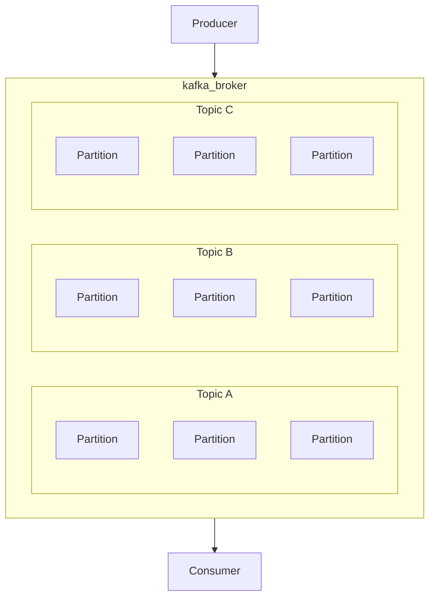
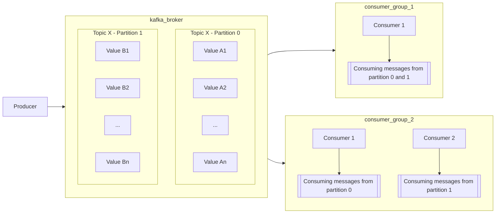
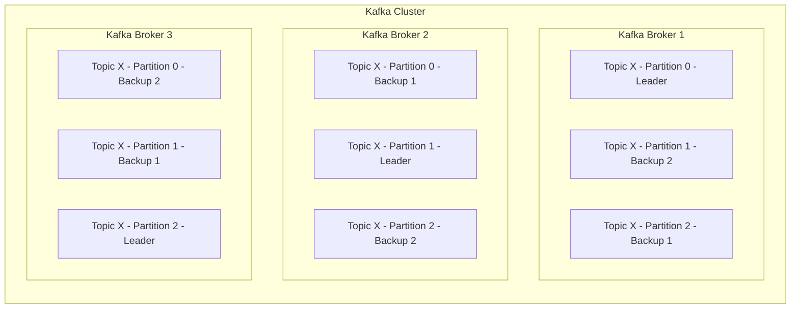

# Introducción

## ¿Qué es Kafka y cómo funciona?

**Apache Kafka** es una plataforma de código abierto para la transmisión de datos, que funciona como una cola de mensajes tradicional de tipo pub-sub, permitiendo la publicación y suscripción a flujos de mensajes.

Lo que lo diferencia de las colas de mensajes tradicionales es que el principal propósito de Kafka es optimizar la transmisión y el procesamiento de los flujos de datos intercambiados. Específicamente, podemos decir que Kafka actúa como intermediario entre el emisor y el receptor al ofrecer una función de mensajería; mediante este método, la plataforma también es capaz de resolver el problema de los datos o mensajes que no se almacenan temporalmente cuando el receptor no está disponible (por ejemplo, problemas de red).

Además, una cola de Kafka bien configurada evita que el emisor sobrecargue al receptor. Esto ocurre cuando la información necesita ser enviada más rápidamente mediante conexión directa, para ser recibida y procesada. Kafka se considera una plataforma adecuada incluso si el sistema de destino recibe el mensaje pero colapsa durante el proceso, donde el error es notificado; en casos normales, a pesar del colapso, uno podría creer que el procesamiento fue exitoso.

Kafka combina tres características clave:

- **Publicar** (escribir) y suscribirse (leer) a flujos de eventos, incluyendo la importación/exportación continua de datos desde otros sistemas.
- **Almacenar** flujos de eventos de manera duradera y confiable durante el tiempo que desees.
- **Procesar** flujos de eventos a medida que ocurren o de forma retrospectiva.

Y toda esta funcionalidad se proporciona de manera distribuida, altamente escalable, elástica, tolerante a fallos y segura. Kafka puede desplegarse en hardware bare-metal, máquinas virtuales y contenedores, tanto en instalaciones locales como en la nube.

## ¿Cuáles son los conceptos fundamentales de Kafka?

En general, Kafka acepta flujos de eventos escritos por los productores de datos. Kafka almacena los datos de forma cronológica en particiones entre **brokers** (servidores); varios brokers forman un clúster. Kafka agrupa estos datos en categorías llamadas **topics**; los consumidores de datos obtienen los datos suscribiéndose a los topics deseados. Cuando lees o escribes datos en Kafka, lo haces en forma de **eventos**. Conceptualmente, un evento tiene una clave, valor, marca de tiempo y encabezados de metadatos opcionales.

## ¿Qué es un evento?

Un **evento** es un mensaje con datos que describen el evento. Por ejemplo, cuando un nuevo usuario se registra en un sitio web, el sistema crea un evento de registro, que puede incluir el nombre del usuario, correo electrónico, contraseña, ubicación, etc.

Los eventos se organizan y se almacenan de manera duradera en **topics**. Simplificando mucho, un topic es similar a una carpeta en un sistema de archivos, y los eventos son los archivos en esa carpeta. Los topics en Kafka siempre son multi-productor y multi-suscriptor: un topic puede tener cero, uno o muchos productores que escriben eventos en él, así como cero, uno o muchos consumidores que se suscriben a estos eventos.

Los eventos en un topic se pueden leer tantas veces como sea necesario, a diferencia de los sistemas de mensajería tradicionales, los eventos no se eliminan después de ser consumidos. En su lugar, se define cuánto tiempo debe retener Kafka tus eventos a través de una configuración por topic, después de lo cual los eventos antiguos serán descartados. El rendimiento de Kafka es efectivamente constante con respecto al tamaño de los datos, por lo que almacenar datos durante mucho tiempo es perfectamente aceptable.

## ¿Qué es un broker y un clúster?

Kafka se ejecuta en **clusters** (esto es una colección de computadoras). Cada clúster está compuesto por múltiples servidores, generalmente llamados **brokers**. Este modo convierte a Kafka en un sistema distribuido porque los datos se distribuyen entre múltiples brokers.

### ¿Quiénes son los consumidores y productores, y qué hacen?

Un **productor** es cualquier entidad que crea datos o produce información o eventos. Por ejemplo, el componente del sitio web responsable de los registros de usuarios produce un evento de "nuevo usuario registrado" o un sensor meteorológico produce eventos de "clima" con información sobre temperatura, humedad, etc.

Los **consumidores**, por otro lado, son aquellos que "consumen" los datos escritos por los productores. Generalmente actúan como consumidores de datos, almacenando o analizando los datos que reciben de Kafka. Por lo tanto, Kafka se encuentra entre productores y consumidores.

## ¿Qué es un topic?

Los eventos se organizan y se almacenan de manera duradera en **topics**. Los productores publican estos eventos en los topics de Kafka mientras que los consumidores se suscriben a los topics para acceder a los datos deseados. Tomando nuevamente el ejemplo del registro, la información sobre el "nuevo usuario" se publica (a través de Kafka) en el topic de "registro". Los suscriptores, a su vez, consumen eventos del topic de "registro" y lo utilizan junto con otros datos como base para la prestación de sus productos o servicios.

Una partición es donde los datos se almacenan en Kafka y sirve para dividir la información recibida en función del topic correspondiente.

Los topics están **particionados**, lo que significa que un topic se distribuye en varios "buckets" ubicados en diferentes brokers de Kafka. Esta distribución de tus datos es muy importante para la escalabilidad porque permite que las aplicaciones cliente tanto lean como escriban datos desde/hacia muchos brokers al mismo tiempo. Cuando se publica un nuevo evento en un topic, en realidad se añade a una de las particiones del topic. Los eventos con la misma clave de evento se escriben en la misma partición, y Kafka garantiza que cualquier consumidor de una partición dada siempre leerá los eventos de esa partición en exactamente el mismo orden en que fueron escritos.

Los consumidores trabajan como parte de un grupo de consumidores, que es uno o más consumidores que trabajan juntos para consumir un topic. El grupo asegura que cada partición sea consumida solo por un miembro. Un mensaje de la cola del topic no se elimina hasta que todos los grupos de consumidores lo hayan consumido (otra forma de eliminar un mensaje de la cola del topic es si el mensaje ha caducado por tamaño de la cola o por tiempo).

Para hacer que tus datos sean tolerantes a fallos y altamente disponibles, cada topic puede ser **replicado**, incluso a través de regiones geográficas o centros de datos, de modo que siempre haya múltiples brokers que tengan una copia de los datos en caso de que algo salga mal, si deseas hacer mantenimiento en los brokers, etc.

El diagrama que se muestra aquí representa lo que hace Kafka:

El siguiente diagrama muestra como funciona un consumidor de kafka:

El siguiente diagrama muestra como funciona un brocker de kafka:

## Página oficial

> Para obtener información más específica, puedes ir a la página oficial haciendo clic en este enlace:
[Documentación oficial de Kafka Apache](https://kafka.apache.org/documentation/)
