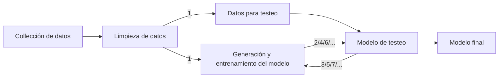
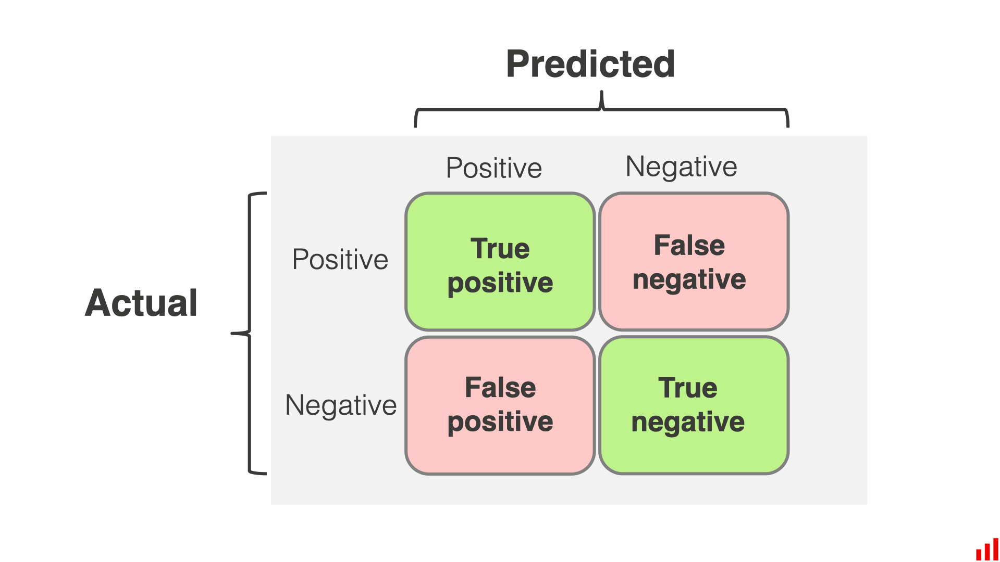

# Machine learning

El **Machine Learning** es una disciplina del campo de la Inteligencia Artificial que, a través de algoritmos, dota a los ordenadores de la capacidad de identificar patrones en datos masivos y elaborar predicciones (análisis predictivo) - sin necesidad de definirles dónde tienen que mirar de forma explícita.

Hay dos tipos principales de machine learning:

* Aprendizaje supervisado.
* Aprendizaje no supervisado.

## Aprendizaje supervisado

Los algoritmos de aprendizaje supervisado con entrenados usando ejemplos etiquetados (**labeled** examples) donde dada una entrada sabemos la salida deseada.

La red recibe una serie de datos de entradas con su correspondiente salida deseada, entonces el algoritmo aprende al comparar su salida actual con la salida deseada y calculando el error. Luego se usa ese error para ajustar el modelo en consecuencia.

### Tipos de datos

| Tipos de datos | Description|
| --- | --- |
| Datos de entrenamiento | Se usan para entrenar los parámetros del modelo.|
| Datos de validación | Se usan para determinar el rendimiento obtenido tras el entrenamiento y determinar si hay que realizar cambio en el modelo, como añadir más neuronas, añadir más capaz, cambiar la arquitectura de la red, etc. Para un entrenamiento simple, este conjunto de datos es opcional, pero es muy recomendable.|
| Datos de testeo | Se usa para calcular el rendimiento final del modelo. En este conjunto se contiene datos que el modelo nunca antes ha visto durante el entrenamiento.|

### Tipos de ajuste

| Tipos de ajuste | Description|
| --- | --- |
| Overfitting (Sobreajuste) | Se produce cuando el modelo se ajusta mucho al ruido de los datos, lo que da un bajo error con los conjuntos de entrenamiento pero un gran error en las pruebas de testeo y validación.|
| Underfitting (Subajuste) | Se produce cuando el modelo no se ajusta lo suficiente (normalmente por ser demasiado simple).|

Un buen modelo debe comenzar con un gran error e ir reduciendo el error a medida que avanza el tiempo que lleva entrenando (tiempo de entrenamiento - en EEUU se llama "epics" - en UK se llama "epochs"), puede ser que el error nunca llegue a cero, pero se mantendrá estable en un valor cercano a cero.

### Evaluación del rendimiento

| Métricas de clasificación | Description|
| --- | --- |
| Accuracy (precisión) | Número de predicciones correctas del modelo dividido entre el total número de predicciones. Para esta medida es importante tener las muestras de testeo balanceadas (misma cantidad de datos de cada posible respuesta).|
| Recall (recuerdo) | Capacidad del modelo para encontrar todos los casos relevantes dentro de un conjunto de datos. Número de positivos verdaderos (true positives) dividido entre el número de positivos verdaderos y falsos negativos (false negatives). |
| Precision (precisión) | Capacidad de un modelo para identificar  sólo los puntos de datos relevantes. Número de positivos verdaderos (true positives) dividido entre el número de positivos verdaderos y falsos positivos (false positives). |
| F1-Score | Es también llamado como la media armónica y es una combinación entre precisión (precision) y recuerdo (recall).  $F = 2*((precision*recall)/(precision+recall))$ |

#### Clasificación de errores

**Confusion matrix** encapsula todos los True/False positives and True/False negatives.

#### Regresión de errores

Para calcular la regresión, las métricas más comunes a usar son:

| Métricas de regresión | Traducción al español | Fórmula |
| --- | --- | --- |
| Mean absolute error (MAE) | Error absoluto medio | $\dfrac{1}{n}\sum_{i}^{n} = abs(y_i-y_i')$ |
| Mean squared error (MSE) | Eror cuadrático medio | $\dfrac{1}{n}\sum_{i}^{n} = abs(y_i-y_i')^2$ |
| Root mean square error (RMSE) | Raíz del error cuadrático medio | $\sqrt{\dfrac{1}{n}\sum_{i}^{n} = abs(y_i-y_i')^2}$ |

## Aprendizaje no supervisado

Esto sucede cuando no sabemos todas las etiquetas posibles. Pare entender sobre el aprendizaje no supervisado antes tenemos que saber sobre los siguientes puntos.

* **Clustering** (Agupación).
  * Agrupar conjuntamente grupo de valores/datos/puntos que no están dentro de una etiqueta.
* **Anomaly Detection** (Deteción de anomalías).
  * Detectar valores atípicos en un conjunto de datos.
* **Dimensionality Reduction** (Redución de anomalías).
  * Técnica de procesamiento de datos que reduce el número de características de un conjunto de datos
