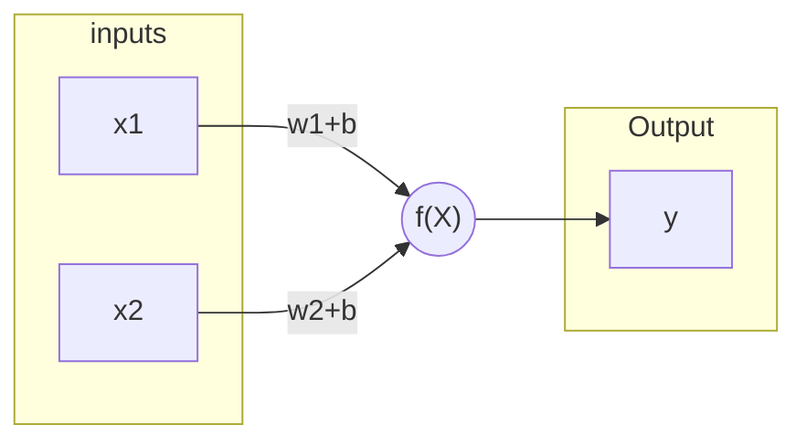
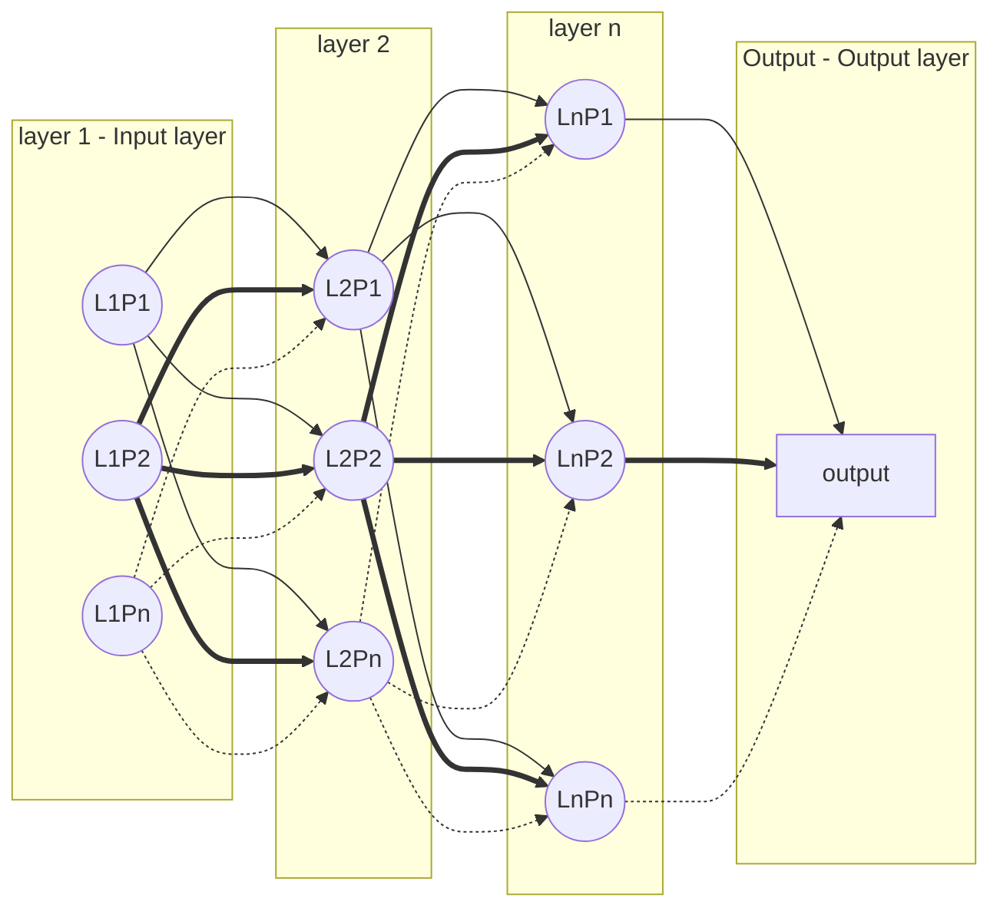

# Artificial Neural Networks (ANNs)

## Modelo del perceptron (Perceptron model)

`w: weight`

`b: bias`

>$\hat{y} = \sum_{i=1}^{n} x_iw_i + b_i$

and if B = b1+b2+...+bn

>$\hat{y} = B + \sum_{i=1}^{n} x_iw_i$

## Redes neuronales (Neural networks)

Las redes neuronales se generan al unir varios modelos de perceptrón en lo que se llama modelo del perceptrón multicapa (`multi-layer perceptron model`).

Las salidas de una capa de perceptrones, se usa como entrada para la siguinte capa de perceptrones.

Los perceptrones también se llaman neuronas.

`L: layer`

`P: perceptron`

* La primera capa se llama capa de entrada (input layer).
* La última capa se llama capa de salida (output layer). Esta última capa puede tener una o más neuronas.
* Las capas entre la capa de entrada y salida se llaman capas escondidas (hidden layers).

Se considera que una red es una redes neuronal profunda (`deep neural networks`) cuando contiene 2 o mñas capas escondidas.
