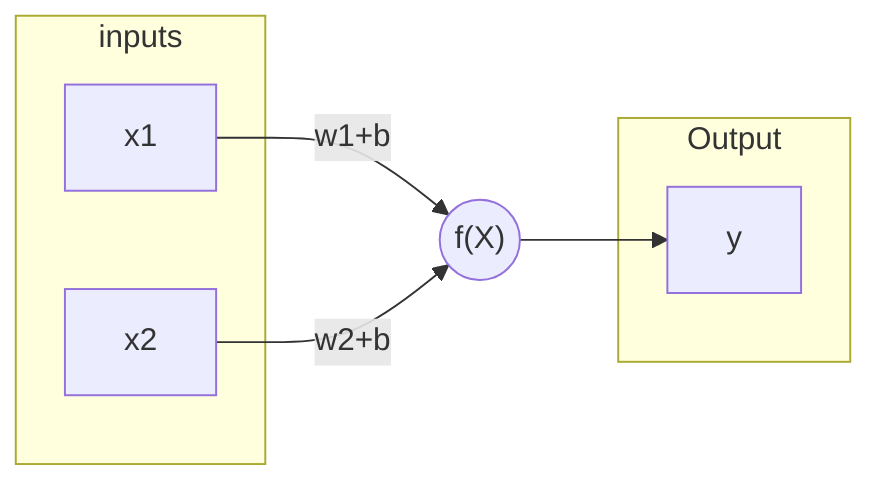

# Artificial Neural Networks (ANNs)

## Modelo del perceptron (Perceptron model)

`w: weight`

`b: bias`

>$\hat{y} = \sum_{i=1}^{n} x_iw_i + b_i$

and if B = b1+b2+...+bn

>$\hat{y} = B + \sum_{i=1}^{n} x_iw_i$
