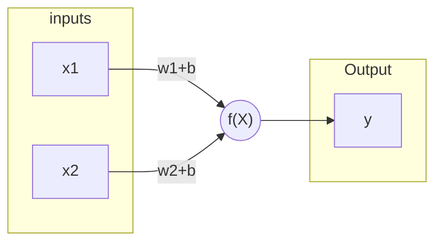
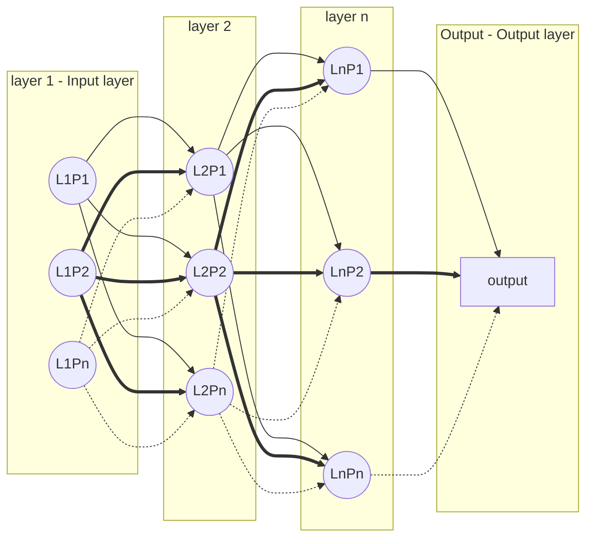
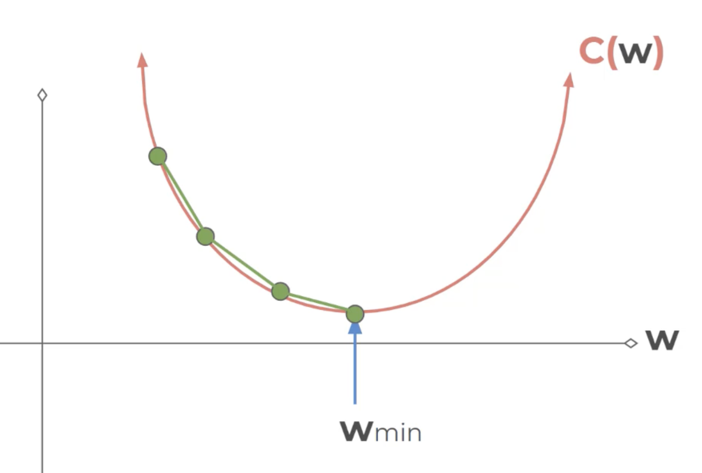

# Artificial Neural Networks (ANNs)

## Modelo del perceptron (Perceptron model)

> w: weight \
b: bias

>$\hat{y} = \sum_{i=1}^{n} x_iw_i + b_i$ \
and if B = b1+b2+...+bn \
$\hat{y} = B + \sum_{i=1}^{n} x_iw_i$

## Redes neuronales (Neural networks)

Las redes neuronales se generan al unir varios modelos de perceptrón en lo que se llama modelo del perceptrón multicapa (`multi-layer perceptron model`).

Las salidas de una capa de perceptrones, se usa como entrada para la siguinte capa de perceptrones.

Los perceptrones también se llaman neuronas.

`L: layer`

`P: perceptron`

* La primera capa se llama capa de entrada (input layer).
* La última capa se llama capa de salida (output layer). Esta última capa puede tener una o más neuronas.
* Las capas entre la capa de entrada y salida se llaman capas escondidas (hidden layers).

Se considera que una red es una redes neuronal profunda (`deep neural networks`) cuando contiene 2 o mñas capas escondidas.

## Funciones de activación (activation functions)

Estas funciones se usan para limitar la salida de cada neurona.

> $Z = W*x + b$

| Activation function | Traducción al español | Descripción |
| --- | --- | --- |
| Step function | Función paso | Salida es 0 si Z<=0, o salida es 1 si Z>0 |
| Sigmoid function | Función sigmoide | Parecida a la step function (mismos límites) pero más suave. $f(z) = \dfrac{1}{(1+e^{-z})}$ |
| Hyperbolic Tangent - tanh(z) | Tangente hiperbólica | Como la función sigmoide, pero en lugar de entre 0 y 1 es entre -1 y 1 |
| Rectified Linear Unit - ReLU | Relu | Salida es 0 si Z<=0, o salida es Z si Z>0. $f(z) = \max(0,z)$ |

To see more activation functions, see link below.

<https://en.wikipedia.org/wiki/Activation_function>

## Clasificación multiclase

Principalmente hay dos tipos de clasificación multiclase.

* **Clases no exclusivas**. Cuando un dato puede ser asignados a varias clases o categerías.
* **Clases mutuamente exclusivas**. Cuando sólo se puede asignar a un dato una clase o categoría.

La mejor forma de organizar multiples clases es tener un nodo de salida por clase o categoría.

## Función de coste y descenso del gradiente

La función de coste, también llamada como función de pérdida, es la media de la diferencia entre la salida de nuestra red neuronal y el valor real.

Una de las funciones de coste más comunes es la función de coste cuadrática.

$C = \dfrac{1}{2n}\sum_{x} abs(y(x)-a^L(x))^2$

>y(x): Valores reales \
a(x): Valores de predicciones \
L: suele ser la última capa. \
$a^L(x): $ Salida de la función de activación de la capa L.

Se puede pensar en la función de coste, como una funcón que depende de 4 elementos principalmante.

$C(W,B, S^r, E^r)$

> W: Pesos de la red. \
B: Todos los bias de la red \
$S^r$: Entrada de una muestra de entrenamiento. \
$E^r$: Salida deseada de esa muestra de entrenamiento.

Lo normal sería utilizar la combinación de elementos que genera el error más bajo, pero calcular esto es muy complejo.

Si cogemos como ejemplo que la función de coste genera una parábola invertida, hay un mínimo en un punto, que sería el *gradiente* (representa la pendiente de la recta tangente a la gráfica de una función - es parecido a la derivada) igual a cero, pero calcular justo el error en ese punto es complicado cuando trabajamos con más de una dimensión, y al mismo tiempo coger una muestra para ver si es un mínimo depende frecuencia de muestreo, esta frecuencia se denomina como **tasa de aprendizaje (learning rate)**.

La técnica **descenso del gradiente adaptativo** intenta solucionar el problema de la tasa de aprendizaje, usando una frecuencia alta cuando el error es muy grande, y una frecuencia menor cuando el gradiente se acerca a cero.

[Video donde se explica el descenso del gradiente](https://www.youtube.com/watch?v=A6FiCDoz8_4)

Dentro de la técnica del descenso del gradiente adaptativo, uno de los métodos más eficiente y común para encontrar estos mínimos es usar el método **Adam ("A method for Stochastic Optimization")**.

Para problemas de clasificación, normalmente se usa la función de coste de **entropía cruzada(cross entropy)**.

## Retropropagación (Backpropagation)

La retropropagación es la técnica que se usa para ajustar los pesos y bias (sesgos) de las diferentes neuronas en cada capa.

Se comienza desde la última capa `L` hacia la izquierda, `L-1`, `L-2`, ... `L-n`.

Enfocandonos en las últimas dos capas (`L` y `L-1`).

>$z = wx+b$

y la función de activación

>$a = \sigma(Z)$

Significa que tenemos

>$z^L = w^La^{L-1}+b^L$ \
\
$z^L$: Salida de la capa L \
$w^L$: Pesos de la capa L \
$a^{L-1}$: Función de activación de la capa anterior = Salida de la capa anterior \
$b^L$: Bias/Sesgos de la capa L

Si contamos todas las capas.

>$a^L = \sigma(Z^L)$

La función de coste quedaría:

>$C_0(...) = (a^L-y)^2$ \
$y$: Salida real

La idea de retroproagación es ir calculando el error en cada capa y usando el gradiente/derivada intentar minimizar dicho error. En un lenguaje más cotidiano, calcular con las derivadas parciales como se ve afectada la función de coste cuando se modifica uno de los parámetros de las neuronas.

> $\frac{\delta C}{\delta w}$

Cuando nos referimos sólo a la última capa:

> $\frac{\delta C}{\delta w^L}  = \frac{\delta C}{\delta a^L} \frac{\delta a^L}{\delta z^L} \frac{\delta z^L}{\delta w^L}  $

[Link explicando las funciones matemáticas (en inglés)](http://neuralnetworksanddeeplearning.com/chap2.html)

[Video es español sobre backpropagation](https://www.youtube.com/watch?v=eNIqz_noix8)

[Video es español sobre matemáticas de backpropagation](https://www.youtube.com/watch?v=M5QHwkkHgAA)
