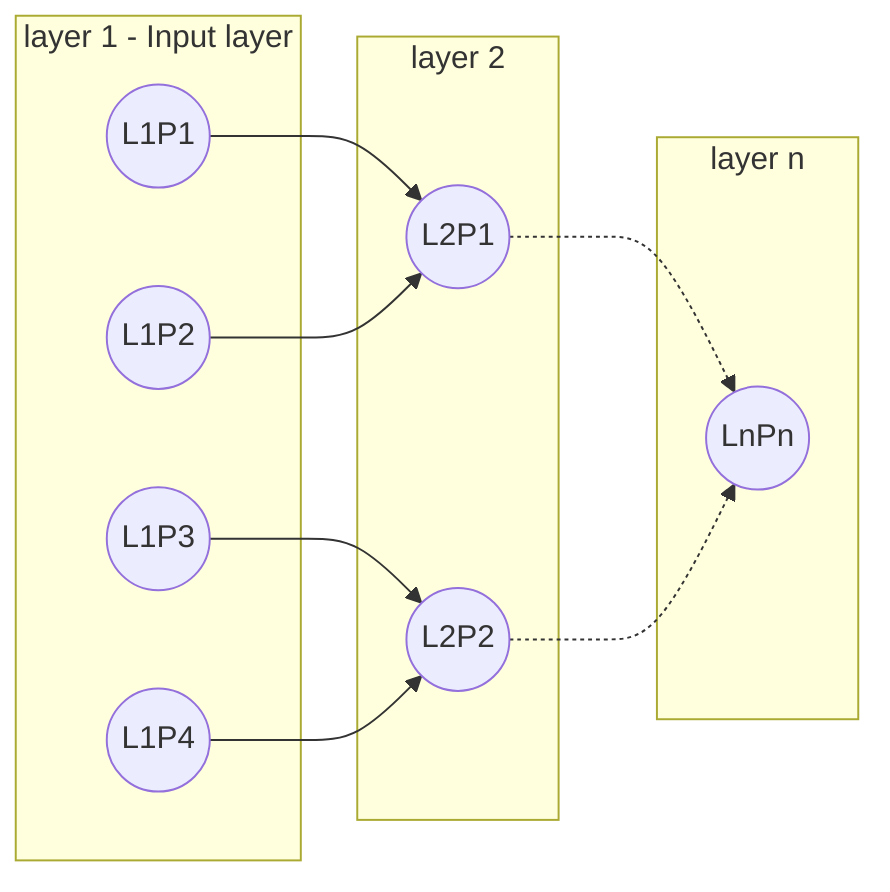
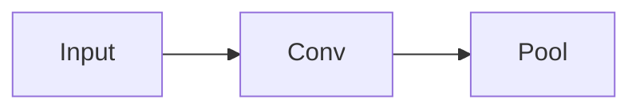

# Redes neuronales convolucionales - Convolutional Neural Networks (CNNs)

Las **redes neuronales convolucionales** es un tipo de red muy útil para trabajar con imágenes.

> Antes de seguir con este punto es importante tener algunos conocimientos de redes neuronales con keras (librería de python), puedes ver [Keras](../../Python/Keras/01%20-%20intro.md) para tener más información.

## Las imágenes son matrices

Una imagen es simplemente una o varias matrices con valores entre 0 y 255 que representa el valor de cada píxel.

Si hablamos de una imagen en blanco y negro sólo trabajaremos con una matriz.

Pero hablamos de una imagen a color, esta se compone por 3 matrices, cada una para un color primario (rojo, verde y azul = RGB). Estos canales de colores es una matriz en escala de grises que indica el valor (0-255) de cada color para cada pixel de la imagen.

Por lo que las características de una imagen a color **(1280, 720,3)** serían las siguientes:

* **1280**  Píxeles de ancho.
* **720**  Píxeles de alto.
* **3**  Canales de colores (RGB).

## Pre-procesamiento de imágenes

### Filtro de imágenes

Filtrar una imagen es aplicar una "**imagen kernel**", que es una pequña matriz, a toda la matriz de la imagen.

Hay filtros bastante comunes como el filtro de difusión que difumina la imagen. Esto se consigue con la siguiente matríz.

$$
Blur Filter = \begin{pmatrix}
  0.0625 & 0.125 & 0.0625 \\
  0.125 & 0.25 & 0.125 \\
  0.0625 & 0.125 & 0.0625
\end{pmatrix}
$$

### Aplicar filtros a una imagen

Cuando aplicamos un filtro, digamos como ejemplo que queremos aplicar un filtro que consiste en una matriz 3x3, la imagen final tendrá un tamaño reducido tras el filtrado, ya que estamos cogiendo 9 píxeles que al aplicarle el filtro sólo genera 1 pixel de salida.

Ver [esta web](https://setosa.io/ev/image-kernels/) donde se explica con un ejemplo real cómo afecta el filtrado a una imagen.

### Kernels convolucionales

Dentro del contexto de CNNs, estos "filtros" son llamados **kernels convolucionales**, y la acción de pasar una imagen a través de ellos se llama **convolución**.

Es importante destacar que al aplicar filtros a la matriz de una imagen, podemos perder información en los bordes de la misma, ya que en dichos bordes no se puede aplicar el filtro. Por lo tanto, es bastante común en el ámbito de las redes convolucionales extender la imagen original rodeándola con ceros para no perder dicha información en los bordes de la imagen original. Esta acción se llama "**padding**".

## Capas convolucionales

Dentro de las redes convolucionales no todos las neuronas de una capa están conectadas con todas las neuronas de la siguinete capa. Con esto conseguimos un proceso similar al filtrado de una imagen.

## Capas de agrupamiento (Pooling layers)

Estas capas aceptan capas convolucionales como entrada, en esta capa podemos aplicar lógical para simplificar el tamaño de la red (reducir número de parámetros), por ejemplo agrupando en ventanas 2x2 y cogiendo el valor máximo o la media.

Otra ténica muy utilizada dentro de CNN es usar "Dropout" layers, que como se explicó anteriormente son capas en las que desactivamos un porcentaje del número total de neuronas de forma aleatoria.

## Arquitectura final de una red convolucional

Hay muchas combinaciones posibles para crear una red convolucional, y la única forma de encotrar la más correcta es probando varias conbinaciones y usar los resultados obtenidos en un intento para mejorar el siguiente intento.

Lo que si tienen en común todas las redes convolucionales es que todas tienen como penúltima capa una capa especial llamada "Fully connected layer (FC)" que implemente una función para poder conectar la salida de la capa anterior a la capa de salida (última capa), esta capa de salida tendrá el mismo número de neuronas como número de clases.

