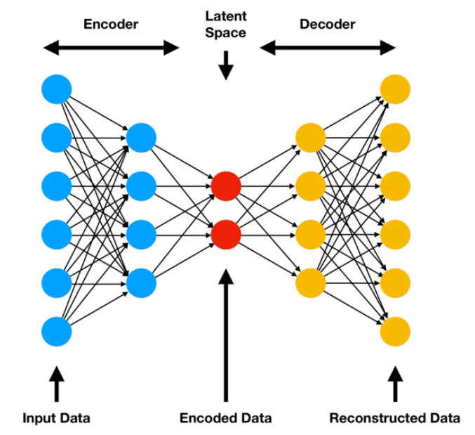

# Autoencoders

Los **autoencoders** son una arquitectura de red neuronal diseñada para aprender una representación comprimida (codificación) de los datos de entrada, generalmente con el objetivo de reducción de dimensionalidad o eliminación de ruido. Están formados por dos partes principales: el codificador (encoder), que transforma los datos originales en una representación de menor dimensión, y el decodificador (decoder), que intenta reconstruir los datos originales a partir de dicha representación comprimida.

Cuando usamos autoencoders nos referimos a redes semi supervisadas, ya que es el autoencoder el responsable de predecir la categoría de la salida.

## Conceptos básicos

Los autoencoders es un tipo de red neuronal simple muy similar al modelo perceptron multicapa (MLP), pero con la diferencia de que tiene una capa de salida que es la misma que la capa de entrada (mismo número de neuronas).

## Beneficios de usar autoencoders

* **Reducción de dimensionalidad**: Permiten transformar datos complejos y de alta dimensión en representaciones más compactas, facilitando el análisis y la visualización.
* **Eliminación de ruido**: Son capaces de aprender las características esenciales de los datos, descartando información irrelevante o ruido, lo que mejora la calidad de los datos procesados.
* Pre-entrenamiento para otras tareas: Las representaciones aprendidas pueden ser utilizadas como características de entrada para otros modelos, mejorando su rendimiento, especialmente cuando los datos etiquetados son escasos.
* Compresión de datos: Ayudan a almacenar información de manera eficiente, útil en contextos donde el espacio de almacenamiento es limitado.
* Detección de anomalías: Al aprender la estructura normal de los datos, los autoencoders pueden identificar patrones atípicos o anómalos cuando la reconstrucción falla.
* Visualización de datos: Permiten visualizar datos complejos en un espacio de menor dimensión, lo que facilita su análisis y comprensión.

En resumen, los autoencoders son herramientas versátiles en machine learning, ya que permiten extraer información relevante, mejorar la calidad de los datos y optimizar recursos en distintas aplicaciones.

