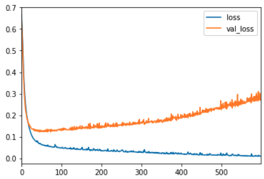

# Keras

**Keras** es una biblioteca de Python utilizada como API para crear redes neuronales de **TensorFlow** fácilmente.

Keras ya viene instalado dentro de Tensorflow por lo que no hay que instalarla manualmente.

## Preparar los datos

```python
import pandas as pd
import numpy and np

import seaborn as sns # Para visualizar datos

# Leer tabla de un archivo csv
df = pd.read_csv('.../x.csv')

# Tabla con una lista de precios dependiendo de dos características.
df.head # Muestra una parte de la tabla

# Mostrar gráficos con los datos de cada columna de la tabla
sns.pairplot(df)
```

### Otras acciones de preprocesamiento de datos

#### Elimnar columnas

Eliminar columnas que no nos sean de utilidad.

```python
# Hay columnas como el id que generalmente no nos sirve.
df = df.drop('id', axis=1)
```

#### Crear nuevas columnas

Si tenemos una columna con fechas ("date") podemos usar dicha columna para crear otras columnas más útiles, como año y mes.

```python
# Para las fechas es importante pasarlo a un formato entendible por la red.
df['date'] = pd.to_datetime(df['date'])

# Función lambda para crear nuevas columnas.
df['year'] = df['date'].apply(lambda date: date.year)
df['month'] = df['date'].apply(lambda date: date.month)

# Otra forma para crear nuevas columnas.
df['year'] = df['date'].dt.year
df['month'] = df['date'].dt.month
```

#### Correlación

Podemos correlacionar las columnas entre sí y ver como impacta un cambio en una columna con el resto de columnas. Ejemplo de correlación entre precio de una casa respecto características de la casa.

```python
# Ejemplo: Precio tiene una alta correlación con los metros cuadrados
df.corr()['price'].sort_values()
'''
zipcode         -0.053402
long             0.022036
condition        0.036056
yr_built         0.053953
sqft_lot15       0.082845
sqft_lot         0.089876
yr_renovated     0.126424
floors           0.256804
waterfront       0.266398
lat              0.306692
bedrooms         0.308787
sqft_basement    0.323799
view             0.397370
bathrooms        0.525906
sqft_living15    0.585241
sqft_above       0.605368
grade            0.667951
sqft_living      0.701917  <<<< Alta correlación
price            1.000000  <<<< Referencia
Name: price, dtype: float64
'''

# Mostrar correlación en un mapa de calor
plt.figure(figsize=(12,7))
sns.heatmap(df.corr(),annot=True,cmap='viridis')
plt.ylim(10, 0)
```

#### Visualizar datos

Mostrar datos antes del entrenamiento por tener un entendimiento más visual.

```python
# Mostrar ambos datos con alta correlación para ver que es bastabte lineal
plt.figure(figsize=(12,8))
sns.scatterplot(x='price',y='sqft_living',data=df)

# Mostrar distribución de precios por habitaciones
sns.boxplot(x='bedrooms',y='price',data=df)

# Gráfica de precios por ubicación
plt.figure(figsize=(12,8))
sns.scatterplot(x='long',y='lat',data=df,hue='price')
# Nota: Hay herramientas externas que te muestran estos valores sobre un mapa real.

# Hay veces en las que merece la pena quitar valores extremos, para tener un resultado más real
len(df)*(0.01) # Salida: 215.97 >> Equivale al 1% de los valores de la tabla
# Ordenamos y quitamos el 1% de las casas más caras
non_top_1_perc = df.sort_values('price',ascending=False).iloc[216:]
# Mostrar datos
plt.figure(figsize=(12,8))
sns.scatterplot(x='long',y='lat',
                data=non_top_1_perc,hue='price',
                palette='RdYlGn',edgecolor=None,alpha=0.2)

# Gráfica de precio por habitaciones
plt.figure(figsize=(12,4))
subgrade_order = sorted(df['bedrooms'].unique())
sns.countplot(x='price',data=df,order = subgrade_order,palette='coolwarm' )
```

#### Agrupar valores

```python
# Se pueden agrupar valores
df.groupby('month').mean()['price'].plot()

# Describir características principales
df.groupby('month')['price'].describe()
```

#### Ver valores únicos

```python
df['zipcode'].unique()

# si los queremos ordenados
sorted(df['zipcode'].unique())
```

#### Contar valores que se repiten

```python
# Ver valores que se repiten
df['zipcode'].value_counts()
```

## Extraer datos de entrenameinto y testeo

Es importante sacar una cantidad de valores de la tabla para entrenar y testear la red neuronal.

```python
from sklearn.model_selection import train_test_split

# Extraemos los datos de entrada
X = df[['feature1', 'feature2']].values
# ".value" porque por como funciona Tensorflow, el tipo tiene que ser numpy array
# "X" en mayus porque es un vector de varias dimensiones (n-dimensiones).

# Predicciones
y = df['price'].values
# ".value" porque por como funciona Tensorflow, el tipo tiene que ser numpy array
# "y" minus porque es un vector de una dimensión


# Separar datos entre entrenameinto y testeo
X_train, X_test, y_train, y_test = train_test_split(X, y, test_size=0.3, random_state=42)
# test_size: Porcentaje de valores que van a ser para testeo
# random_state: Semilla que se usa para generar un valor random para coger los valores. Si se quiere coger los mismos grupos de datos en el futuro hay que mantener este número.

# Comprobar tamaño de los grupos
X_train.shape # (700, 2) --> 70% del total
X_test.shape # (300, 2) --> 30% del total
```

## Escalar valores

Es importante normalizar y esclar los datos para que la red neuronal puede trabajar sin problemas.

```python
from sklearn.preprocessing import MinMaxScaler

# Normalizamos los datos
scaler = MinMaxScaler() # Este scaler va a normalizar los datos entre 0 y 1.

# Calculamos cuales son los parámetros necesarios para normalizar los datos de entrenamiento.
# Esto se hace sólo en el conjunto de entrenamiento para no falsear el grupo de testeo.
scaler.fit(X_train) 
X_train = scaler.transform(X_train)
X_test = scaler.transform(X_test)
```

## Crear y entrenar modelo

Crear el modelo usando keras que se encuentra dentro de la librería de tensorflow.

```python
from tensorflow.keras.models import Sequential
from tensorflow.keras.layers import Dense

# Creamos el modelo pasándole una lista de las capas que queremos tener.
# Dense layer es una capa que cada neurona conecta con cada neurona de la siguiente capa.
# units: número de neuronas por capa (4 en este ejemplo)
# activation function: relu
model = Sequential([Dense(units=4, activation='relu')])
# si queremos crear un modelo con dos capas, simplemente añadimos dos capas Dense a la lista.
model = Sequential([Dense(units=4, activation='relu'),
                    Dense(units=2, activation='relu'),
                    Dense(units=1)]) # Última capa no necesita función de activación

# Otra forma de crear un modelo
model = Sequential()
model.add(Dense(units=4, activation='relu'))
model.add(Dense(units=4, activation='relu'))
model.add(Dense(units=4, activation='relu'))
model.add(Dense(units=4, activation='relu'))
model.add(Dense(units=1)) # Sólo un nodo en la capa final porque sólo queremos un output

# Compilar el modelo
model.compile(
        optimizer='rmsprop', # modelo para calcular el gradiente descendiente
        loss='mse', # depende de qué queramos conseguir: multi-class clasification, binary classification or regression problem // See docstring from compiler function.      
)

# Entrenar modelo
model.fit(
    x=X_train, # Datos de entrada
    y=y_train, # Salida esperada
    epochs=250 # Cuantas veces se va a usar cada dato de entrada para entrenar el modelo
)

# Mostrar como el error ha ido disminuyendo
loss_df = pd.DataFrame(model.history.history)
loss_df.plot()
```

### Modificaciones en el entrenamiento

Hay veces donde tras entrenar un modelo vamos a ver que estamos haciendo algo mal, ya que el error con las muestras de testeo no siempre disminiyen.



Como se puede ver en la gráfica, el error varía mucho entre el error del entrenamiento y el error de validación, este es un claro ejemplo de "overfitting", donde el modelo se ajusta mucho a las muestras de entrenamiento pero no a las de testeo.

Para solucionar esto es importante usar callback para detener el entrenamiento cuando se esté sufriendo de "overfitting".

Tenemos varias formas de reducir este problema.

#### Detener entrenamiento

```python
from tensorflow.keras.callbacks import EarlyStopping

# Creamos el modelo
model = Sequential()
model.add(Dense(units=30,activation='relu'))
model.add(Dense(units=15,activation='relu'))
model.add(Dense(units=1,activation='sigmoid'))
model.compile(loss='binary_crossentropy', optimizer='adam')

# Definimos callback para detener el entrenamiento
early_stop = EarlyStopping(monitor='val_loss', mode='min', verbose=1, patience=25)
# patience se usa para esperar 25 epochs desde que se encuentra un punto min para evitar muestras con ruido.

# Creamos modelo con el callback early stop
model.fit(x=X_train, 
          y=y_train, 
          epochs=600,
          validation_data=(X_test, y_test), verbose=1,
          callbacks=[early_stop]
          )

model_loss = pd.DataFrame(model.history.history)
model_loss.plot()
```

#### Eliminar capas

```python
from tensorflow.keras.layers import Dropout

# Creamos el modelo
model = Sequential()
model.add(Dense(units=30,activation='relu'))
model.add(Dropout(0.5)) # De forma aleatoria quitamos o dejamos el 50% de las neuronas de esta capa
model.add(Dense(units=15,activation='relu'))
model.add(Dropout(0.5))# De forma aleatoria quitamos o dejamos el 50% de las neuronas de esta capa
model.add(Dense(units=1,activation='sigmoid'))
model.compile(loss='binary_crossentropy', optimizer='adam')

# Definimos callback para detener el entrenamiento
early_stop = EarlyStopping(monitor='val_loss', mode='min', verbose=1, patience=25)
# patience se usa para esperar 25 epochs desde que se encuentra un punto min para evitar muestras con ruido.

# Creamos modelo con el callback early stop
model.fit(x=X_train, 
          y=y_train, 
          epochs=600,
          validation_data=(X_test, y_test), verbose=1,
          callbacks=[early_stop]
          )

model_loss = pd.DataFrame(model.history.history)
model_loss.plot()
```

## Evaluar el modelo

El siguiente paso es testear el modelo con pruebas que nunca ha visto antes, es decir, las muestras de testeo.

```python
# Evaluar modelo entrenado
model.evaluate(X_test, y_test, verbose=0)
# Salida: 24.9722... Significa la pérdida, el error cuadrático medio (mse).

# Precedir salidas
test_predictions = model.predict(X_test)

# Preparar datos para crear gráfica entre valores reales y predicciones
test_predictions = pd.Series(test_predictions.reshape(300,))
pred_df = pd.DataFrame(y_test, columns['Test True Y'])
pred_df = pd.concat([pred_df, test_predictions], axis=1)
pred_df.columns = ['Test True Y', 'Model Predictions']

sns.scatterplot(x='Test True Y', y='Model Predictions', data=pred_df)
```

Podemos calcular rápidamente otros tipos de errores:

```python
from sklearn.metrics import mean_absolute_error, mean_squared_error

mean_absolute_error(pred_df['Test True Y'], pred_df['Model Predictions'])
# Salida: aprox 4

df.describe()
# mean is aprox 500, so having an error of 4 means we model is working fine

mean_squared_error(pred_df['Test True Y'], pred_df['Model Predictions'])
# Salida: aprox 24.97...
```

Si quisiesemos probar con datos de entrada totalmente nuevos:

```python
# Nuevos datos de entrada
new_gem = [[998, 1000]]
# Es importante recordar que tenemos que escalar los datos de entrada
new_gem = scaler.transform(new_gem)
# Predecir usando el modelo
model.predict(new_gem)
# Salida: aprox 419
```

### Evaluar modelos binarios

```python
from sklearn.metrics import classification_report,confusion_matrix

predictions = model.predict_classes(X_test)

# https://en.wikipedia.org/wiki/Precision_and_recall
print(classification_report(y_test,predictions))
'''
              precision    recall  f1-score   support

           0       0.96      0.98      0.97        55
           1       0.99      0.98      0.98        88

    accuracy                           0.98       143
   macro avg       0.98      0.98      0.98       143
weighted avg       0.98      0.98      0.98       143
'''

print(confusion_matrix(y_test,predictions))
'''
[[54  1]
 [ 2 86]]
'''
```

## Guardar y cargar modelos

Si entrenamos un modelo muy grande que requiere mucho tiempo de entrenamiento es importante guardar el modelo para no tener que entrenarlo cada vez que queramos usarlo.

```python
from tensorflow.keras.models import load_model

# Guardar modelo en archivo 'my_gem_model.h5' 
model.save('my_gem_model.h5')

# Cargar modelo
later_model = load_model('my_gem_model.h5')
later_model.predict(new_gem)
```
