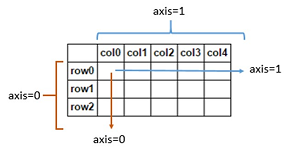
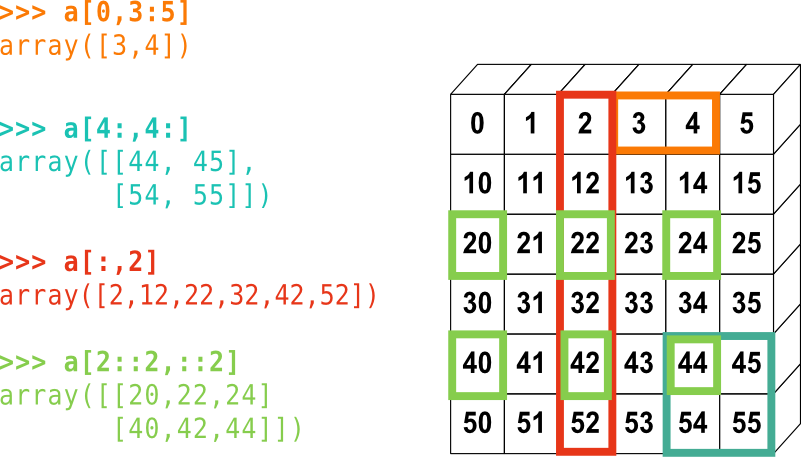

# Índices

## Usar índices en arrays

Índices se utulizan para indicar la posición de un valor dentro de un array.

```py
arr = np.arange(0,11)
# array([ 0,  1,  2,  3,  4,  5,  6,  7,  8,  9, 10])
arr[8] # Coger el valor del array en la posición 8
# 8
arr[1:5] # Coger array entre las posiciones 1 y 5
# array([1, 2, 3, 4])
arr[:5]  # Coger array desde el inicio hasta la posición indicada
# array([0, 1, 2, 3, 4])
arr[5:]  # Coger array desde la posición indicada hasta el final
# array([ 5,  6,  7,  8,  9, 10])
```



### Índices en matrices (2D arrays)

```py
arr_2d = np.array(([5,10,15],[20,25,30],[35,40,45]))
arr_2d
'''
array([[ 5, 10, 15],
       [20, 25, 30],
       [35, 40, 45]])
'''
arr_2d.shape
# (3, 3) = (fila, columna)
arr_2d[1] # Coger fila 1
# array([20, 25, 30])
arr_2d[1][0] # Coger elemento (1,0)
# 20
arr_2d[:2,1:] # Coger una parte de la matriz
'''
array([[10, 15],
       [25, 30]])
'''
arr_2d[2,:]
# array([35, 40, 45])
```




## Broadcasting (transmisión)

Los arrays NumPy difieren de las listas normales de Python debido a su capacidad de broadcasting (transmisión). Con las listas, solo puedes reasignar partes de una lista con nuevas partes del mismo tamaño y forma. Es decir, si quisieras reemplazar los primeros 5 elementos de una lista con un nuevo valor, tendrías que pasar una nueva lista de 5 elementos. Con los arrays NumPy, puedes transmitir un solo valor a través de un conjunto más grande de valores.

```py
arr = np.arange(0,11)
# array([ 0,  1,  2,  3,  4,  5,  6,  7,  8,  9, 10])
arr[0:5]=100 # sobreescribe los primeros 5 valores con el valor definido
arr
# array([100, 100, 100, 100, 100,   5,   6,   7,   8,   9,  10])

seg_array = arr[6:] # seleccionar parte del array
seg_array
# array([ 6,  7,  8,  9, 10])

seg_array[:] = 99 # sobreescribir todo el array
seg_array
# array([99, 99, 99, 99, 99])

## IMPORTANTE: ESTOS CAMBIOS TAMBIÉN AFECTAN AL ARRAY PRINCIPAL, SI NO QUEREMOS QUE SEA ASÍ, DEBEMOS COPIAR EL ARRAY
arr
# array([100, 100, 100, 100, 100,   5,  99,  99,  99,  99,  99])

arr_copy = arr.copy() # Copiando el array podemos trabajar en ambos de forma independiente
```

## Condicionales de selección

```py
arr = np.arange(0,11)
# array([ 0,  1,  2,  3,  4,  5,  6,  7,  8,  9, 10])

bool_arr = arr>4
bool_arr
# array([False, False, False, False,  True,  True,  True,  True,  True, True])

arr[bool_arr] # Coger sólo elementos que cumplan la condición
# array([ 5,  6,  7,  8,  9, 10])

x = 2
arr[arr>x]
# array([ 3,  4,  5,  6,  7,  8,  9, 10])
```