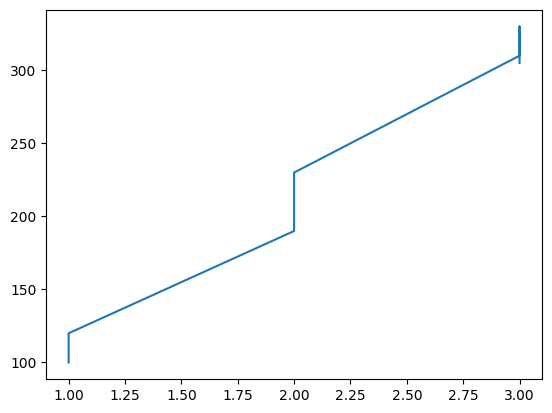
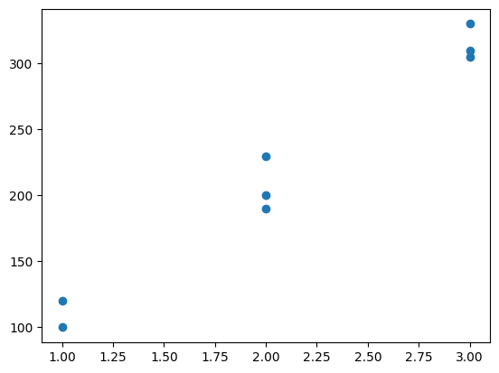
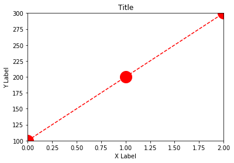

# Matplotlib

**Matplotlib** es una biblioteca de Python utilizada para crear gráficos y visualizaciones de datos. Es especialmente popular en la comunidad científica y de análisis de datos por su capacidad para generar una amplia variedad de gráficos, como gráficos de líneas, barras, histogramas y dispersión. Además, permite personalizar los gráficos de manera detallada, lo que la hace muy versátil para diferentes tipos de proyectos.

## Visualizar gráficas

Para visualizar la gráfica hay que definir los valores para cada eje y luego unir ambas listas en una tabla.

```python
import matplotlib.pyplot as plt

x = [0, 1, 2]
y = [100, 200, 300]

plt.plot(x, y) # Si añadimos ';' al final de esta línea no se mostrará el texto en el output del comando.
plt.show() # Esta línea es necesaria en archivos '.py' para crear la nueva ventana donde mostrar la gráfica. 
```

## Herramientas básicas

```python
import numpy as np
import pandas as pd

housing = pd.DataFrame({'rooms':[1,1,2,2,2,3,3,3],
                       'price':[100,120,190,200,230,310,330,305]})

'''
    rooms price
0   1     100
1   1     120
2   2     190
3   2     200
4   2     230
5   3     310
6   3     330
7   3     305
'''
```

Mostrando esta gráfica por defecto no se muestra demasiado bien. Debido a que los valores no tiene  demasiada relación entre ellos.

```python
plt.plot(housing['rooms'],housing['price'])
```



Por ello, podemos elegir otro typo de gráfica donde los valores se vean más claros.

```python
plt.scatter(housing['rooms'],housing['price'])
```



## Añadir estilo

Se puede costumizar la gráfica de muchas maneras, como añadir límites a los ejes, añadir nombre a los ejes, usar otro tipo de línea, etc.

```python
import matplotlib.pyplot as plt

x = [0, 1, 2]
y = [100, 200, 300]

# Cambiar tipo de línea y puntos.
plt.plot(x,y,color='red',marker='o',markersize=20,linestyle='--')

# Añadir límite a los ejes
plt.xlim(0,2)
plt.ylim(100,300)


# Añadir título y nombres a los ejes
plt.title('Title')
plt.xlabel('X Label')
plt.ylabel('Y Label')
plt.show();
```


