# Seaborn

**Seaborn** es una biblioteca de visualización de datos en Python que se basa en Matplotlib. Proporciona una interfaz de alto nivel para crear gráficos estadísticos atractivos y fáciles de interpretar. Seaborn se integra estrechamente con las estructuras de datos de pandas, lo que facilita la exploración y comprensión de los datos

## Visualizar gráficas

Para visualizar la gráfica hay que definir los valores para cada eje y luego unir ambas listas en una tabla.

```python
import pandas as pd
import matplotlib.pyplot as plt

import seaborn as sns

df = pd.read_csv('../DATA/heart.csv')

df.head()
```

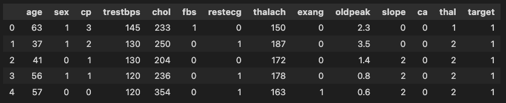

## Graficas de distribución

```python
sns.distplot(df['age'])
```

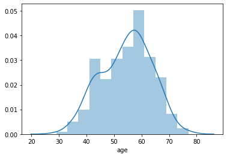

## Cambios en la gráfica

```python
plt.figure(figsize=(12, 8))
sns.distplot(df['age'], kde=False, bins=40, color='red')
# kde=False -> Disable kernel density estimate line
# bins=40 -> Change nums of columns
# color='red' -> Select main color

# Límites en el eje x
# plt.xlim(50,60)
```

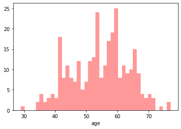

## Gráficos de cuentas

Gráficos de cuentas (count plot). Por ejemplo si en una tabla queremos contar número de hombres y mujeres.

```python
sns.countplot(x='sex',data=df)
```


```python
sns.countplot(x='cp',data=df)
```

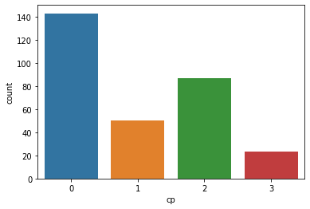

A su misma vez podemos unir las dos gráficas anteriores y contar los datos por sexo.

```python
sns.countplot(x='cp',data=df,hue='sex')
```

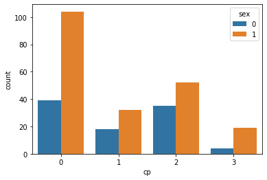

También podemos cambiar la paleta de colores.

<https://matplotlib.org/3.1.0/tutorials/colors/colormaps.html>

```python
sns.countplot(x='cp',data=df,palette='terrain')
```

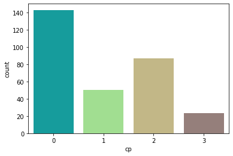

## Diagrama de cajas

Diagrama de cajas (Box plot). Este tipo de gráfica nos ayuda a mostrar la distribución de los valores.


```python
sns.boxplot(x='sex',y='age',data=df)
```

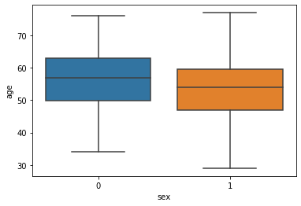

```python
sns.boxplot(x='target',y='thalach',data=df,hue='sex')
```

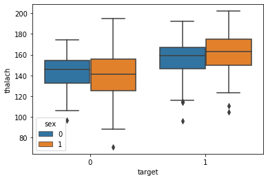

## Diagramas de dispersión

Diagramas de dispersión (Scatter  Plots).

```python
sns.scatterplot(x='chol',y='trestbps',data=df)
```

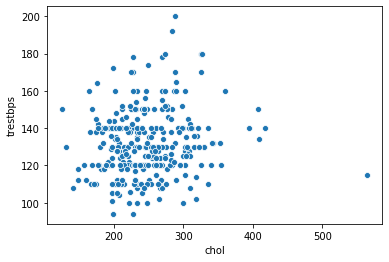

```python
sns.scatterplot(x='chol',y='trestbps',data=df,hue='sex',palette='Dark2')
```

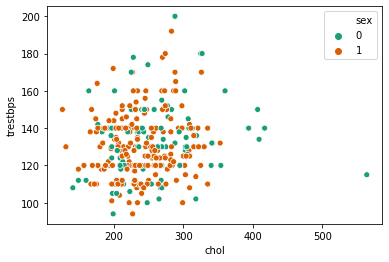

```python
sns.scatterplot(x='chol',y='trestbps',data=df,hue='sex',size='age')
```

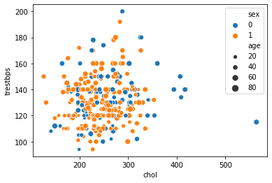

## Diagramas de pares

Diagramas de pares (Pairplots).

```python
iris = pd.read_csv('../DATA/iris.csv')
iris.head()
```

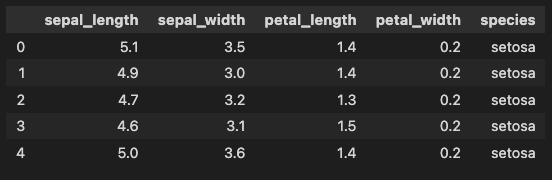

```python
sns.pairplot(iris)
```

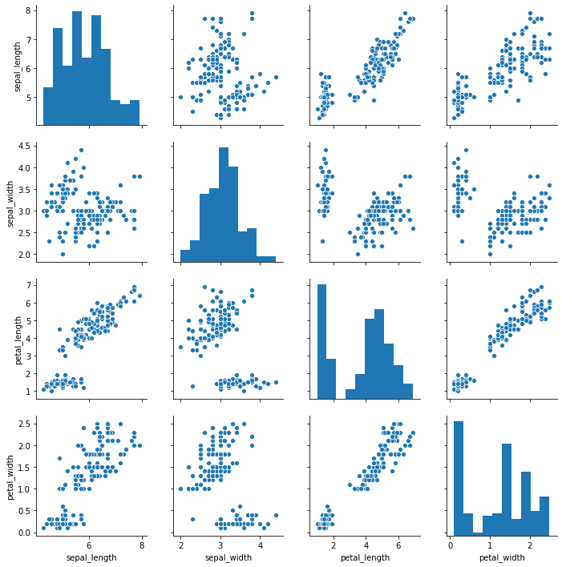

Nota: Hay que destacar que las gráficas están diplicados en modo espejo con la diagonal.

```python
sns.pairplot(iris, hue="species")
```

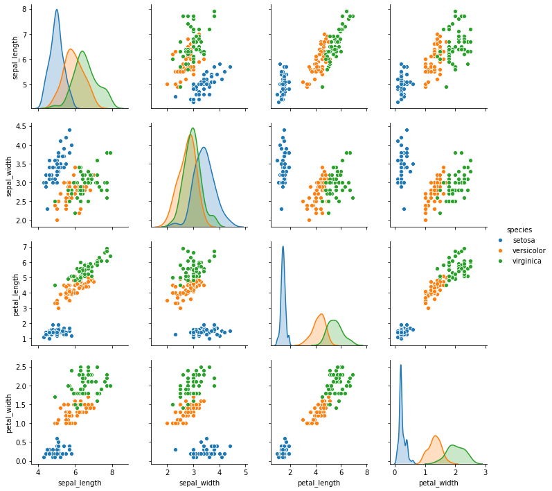
